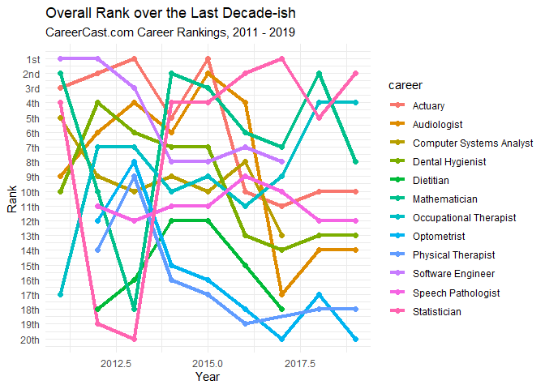

Be an Actuary: Low stress, high pay. Case closed?
-------------------------------------------------

At the end of 2013, I decided prior to beginning my junior year at the
University of Pennsylvania that I’d wanted to be an actuary. One of the
many compelling forces that had brought me to this particular career
strategy was the widely cited career outlook for actuaries around that
period of time. For example, from
[BeAnActuary.org](https://beanactuary.org/why/?fa=a-top-ranked-job):

The link whisks you off to a list of articles, not a single one newer
than 2016, promoting the high-pay/low-stress benefits of becoming an
actuary. It sure is a little stale, and so much has changed with respect
to the bucket of functions we use to map data to decisions since 2016.
So I took to the web to see how the “Actuary” career was faring in 2019
on the same career ranking site that was boasting top billing for the
profession back in 2013.

And, well, things have changed.

Web Scraping: Now (mostly) legal, still the same amount of fun as always
------------------------------------------------------------------------

The web is rich with info, and I love to scrape it. And thanks to a
[relatively recent 9th Circuit
case](https://www.vice.com/en/article/9kek83/linkedin-data-scraping-lawsuit-shot-down),
provided there’s no specific legislation barring the practice or
conflicting circuit court of appeals ruling that requires SCOTUS
intervention, it’s now legal (at least, for non-commercial reasons) and
is likely to remain that way.

Scraping the web is easy to do, and is a great way to make an
un-automated task sail by pretty quickly. If you’re a Python person, you
can use the
[BeautifulSoup](https://www.crummy.com/software/BeautifulSoup/) package
(`pip install beautifulsoup4`). If you’re an R person, then
[rvest](https://github.com/tidyverse/rvest) is the package for you.
Since I like to generally scrape data to `ggplot` it, I almost always
use the `tidyverse`’s `rvest` package (as in “harvest”), but you should
live your best life.

Also, it’s helpful to have a [CSS
SelectorGadget](https://selectorgadget.com/) or similar browser
extension to give your webscraping efforts more surgical precision, but
sometimes it’s easier to look at the page source, or grab the HTML
broadly and whittle it down in code.

CareerCast.com: Does the Actuary gig still get top billing?
-----------------------------------------------------------

I turned my attention to the [CareerCast Top 200 Careers of
2013](https://www.careercast.com/jobs-rated/best-worst-jobs-2013)
report, which ranks careers on an overall index based on job stress
levels, projected career growth outlook, and work environment. Sure
enough, in 2013, there it was in the number one slot:

I love being an actuary, and I think most actuaries love being
actuaries, so I shimmied on over to the [CareerCast Top 200 Careers of
2019](https://www.careercast.com/jobs-rated/2019-jobs-rated-report)
report, and there it was, halfway down the Top 20 at \#10.

What happened? And what had taken the top spot? Was it… no.. it couldn’t
be. Could it?

Of course it’s No. 1. *Touché*.

    rankings_url <- "https://www.careercast.com/jobs-rated/2019-jobs-rated-report?page=0"
    scrape_careercast_page(rankings_url)

    ## # A tibble: 20 x 5
    ##    career           overall_rank work_environment_~ stress_rank proj_growth_rank
    ##    <chr>            <chr>        <chr>              <chr>       <chr>           
    ##  1 Data Scientist   1/200        4/200              42/200      37/200          
    ##  2 Statistician     2/200        11/200             43/200      7/200           
    ##  3 University Prof~ 3/200        1/200              5/200       54/200          
    ##  4 Occupational Th~ 4/200        6/200              34/200      22/200          
    ##  5 Genetic Counsel~ 5/200        25/200             15/200      12/200          
    ##  6 Medical Service~ 6/200        39/200             20/200      32/200          
    ##  7 Information Sec~ 7/200        44/200             26/200      15/200          
    ##  8 Mathematician    8/200        55/200             32/200      7/200           
    ##  9 Operations Rese~ 9/200        47/200             8/200       18/200          
    ## 10 Actuary          10/200       8/200              80/200      28/200          
    ## 11 Software Develo~ 11/200       68/200             27/200      22/200          
    ## 12 Speech Patholog~ 12/200       46/200             22/200      41/200          
    ## 13 Dental Hygienist 13/200       48/200             19/200      32/200          
    ## 14 Audiologist      14/200       68/200             4/200       29/200          
    ## 15 Radiation Thera~ 15/200       8/200              67/200      72/200          
    ## 16 Web Developer    16/200       32/200             49/200      54/200          
    ## 17 Application Sof~ 17/200       141/200            27/200      9/200           
    ## 18 Physical Therap~ 18/200       105/200            47/200      15/200          
    ## 19 Physicist        18/200       44/200             78/200      63/200          
    ## 20 Optometrist      20/200       78/200             87/200      41/200

As you can see, I went ahead and made a handy little function to handle
all the webscraping. All I need to do is insert the URL for the year I
want to scrape, and boom! Data.

There’s a reason I made this a function - it’s so I could scrape the
CareerCast site from the last ten or so years, and see what careers have
risen and fallen in their ranking methodology as well as which have
remained completely consistent and stable over the last decade.

My only hope is that their web design philosophy and CSS naming
conventions have remained just as consistent!

By the way, since it’s only ten years, I’ve chosen to do it by hand, but
if we were doing any more than a decade, this is the kind of stuff
`purrr::map()` is made for. Once we’ve got the data pulled, we’re ready
to plot.

    plotRanking("overall_rank", data=data)

    ## [1] "Overall Rank"

    ## `summarise()` ungrouping output (override with `.groups` argument)

    ## Joining, by = "career"

